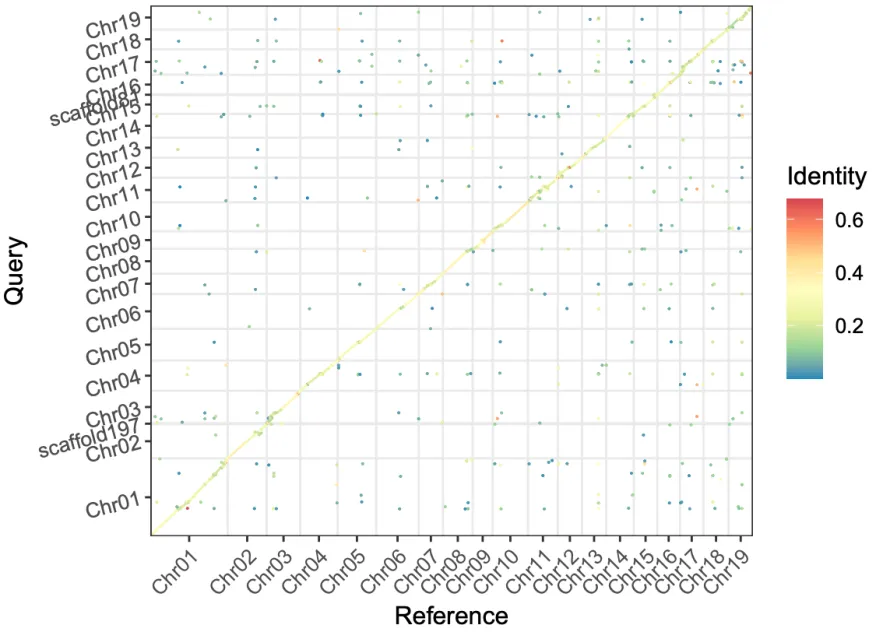

# gf_reorder

## 1. Description
GFF and FASTA files' rename and reorder.

## 2. Installation
```
git clone https://github.com/shwzhao/gf_reorder
export PATH=$PATH:$PWD/gf_reorder/bin
```

dependences:
- biopython
- pandas
- numpy
- argparse

## 3. Usage Example
```
gf_reorder -h
## usage: gf_reorder [-h] {match,reorder} ...
## 
## GFF and FASTA files' rename and reorder.
## 
## options:
##   -h, --help       show this help message and exit
## 
## subcommands:
##   {match,reorder}
##     match          Process a PAF file to generate a summarized rename mapping TSV file.
##     reorder        Update GFF and FASTA files based on rename mapping.
```

### Genome Comparision

- Downloading Populus trichocarpa v4.1 genome and annotation file (https://phytozome-next.jgi.doe.gov/) .
```
# curl ...
# unzip download.20241210.102316.zip
mv Phytozome/PhytozomeV13/Ptrichocarpa/v4.1/assembly/Ptrichocarpa_533_v4.0.fa.gz Populus_trichocarpa.genome.fa.gz
mv Phytozome/PhytozomeV13/Ptrichocarpa/v4.1/annotation/* .
mv Ptrichocarpa_533_v4.1.cds.fa.gz Populus_trichocarpa.cds.fa.gz
mv Ptrichocarpa_533_v4.1.gene.gff3.gz Populus_trichocarpa.gff.gz
mv Ptrichocarpa_533_v4.1.protein.fa.gz Populus_trichocarpa.pep.fa.gz
```

- Downloading Populus tremula v2.2 genome and annotation file ().
```
# https://plantgenie.org/
wget -c ftp://plantgenie.org:980/Data/PlantGenIE/Populus_tremula/v2.2/fasta/Potra02_genome.fasta.gz -O Populus_tremula.genome.fa.gz
wget -c ftp://plantgenie.org:980/Data/PlantGenIE/Populus_tremula/v2.2/gff/Potra02_genes.gff.gz -O Populus_tremula.gff.gz
wget -c ftp://plantgenie.org:980/Data/PlantGenIE/Populus_tremula/v2.2/fasta/Potra02_proteins.fasta.gz -O Populus_tremula.pep.fa.gz
wget -c ftp://plantgenie.org:980/Data/PlantGenIE/Populus_tremula/v2.2/fasta/Potra02_CDS.fasta.gz -O Populus_tremula.cds.fa.gz

gunzip *gz
```

- Genome Comparision
```
ref=Populus_trichocarpa.genome.fa
asm=Populus_tremula.genome.fa

minimap2 \
  -x asm20 \
  ${ref} \
  ${asm} \
  --secondary=no \
  -t 28 \
  -o ${ref%%.genome.fa}-${asm%%.genome.fa}.paf
```

- Visualization of genome comparision using [paf2dotplot.r](https://github.com/moold/paf2dotplot)
```
paf2dotplot.r \
  ${ref%%.genome.fa}-${asm%%.genome.fa}.paf \
  -o ${ref%%.genome.fa}-${asm%%.genome.fa} \
  -s
```

### Name Matching
```
gf_reorder match -h
## usage: gf_reorder match [-h] -i INPUT [-o OUTPUT] [-u] [--ref-prefix REF_PREFIX]
##                         [--query-prefix QUERY_PREFIX] [--min-query-len MIN_QUERY_LEN]
##                         [--min-rev-comp-len MIN_REV_COMP_LEN]
## 
## options:
##   -h, --help            show this help message and exit
##   -i INPUT, --input INPUT
##                         Input .paf filename
##   -o OUTPUT, --output OUTPUT
##                         Output .tsv filename (default: standard output)
##   -u, --uniq            Get the best match of ref (default: False)
##   --ref-prefix REF_PREFIX
##                         Filter by refID prefix (optional)
##   --query-prefix QUERY_PREFIX
##                         Filter by queryID prefix (optional)
##   --min-query-len MIN_QUERY_LEN
##                         Minimum queryLenAgg value to retain (default: 0)
##   --min-rev-comp-len MIN_REV_COMP_LEN
##                         Minimum absolute queryRevCompLen value to retain (default: 0)
```

```
gf_reorder match \
  -i Populus_trichocarpa-Populus_tremula.paf \
  --ref-prefix Chr \
  -u \
  -o match.Chr.uniq.tsv

cat match.Chr.uniq.tsv
## queryID refID   queryLenAgg     queryRevCompLen queryRevComp
## chr1    Chr01   55066110        53513400        +
## chr2    Chr02   26341879        -24135961       -
## chr3    Chr03   23103982        -22203046       -
## chr4    Chr04   25666740        24242942        +
## chr5    Chr05   26916815        -26755463       -
## chr6    Chr06   29241600        -29182278       -
## chr7    Chr07   15443256        -14909270       -
## chr8    Chr08   20184575        19484275        +
## chr9    Chr09   13956658        -10853920       -
## chr10   Chr10   22415260        -21344620       -
## chr11   Chr11   17996883        -13354147       -
## chr12   Chr12   15453450        10316390        +
## chr13   Chr13   17240826        -17026306       -
## chr14   Chr14   17994729        17686749        +
## chr15   Chr15   15082385        -15032917       -
## chr16   Chr16   16029441        15879093        +
## chr17   Chr17   16157912        -13467624       -
## chr18   Chr18   17098567        -16557143       -
## chr19   Chr19   17011095        -15960817       -
```


### Rename and Reorder
```
gf_reorder reorder -h
## usage: gf_reorder reorder [-h] -i INPUT_GFF -g INPUT_GENOME -r RENAME_FILE -I OUTPUT_GFF -G OUTPUT_GENOME
##                           [--prefix PREFIX] [--length_threshold LENGTH_THRESHOLD] [--log_file LOG_FILE]
## 
## options:
##   -h, --help            show this help message and exit
##   -i INPUT_GFF, --input_gff INPUT_GFF
##                         Path to the input GFF file.
##   -g INPUT_GENOME, --input_genome INPUT_GENOME
##                         Path to the query genome FASTA file.
##   -r RENAME_FILE, --rename_file RENAME_FILE
##                         Path to the rename mapping file.
##   -I OUTPUT_GFF, --output_gff OUTPUT_GFF
##                         Path to the output GFF file.
##   -G OUTPUT_GENOME, --output_genome OUTPUT_GENOME
##                         Path to the output genome FASTA file.
##   --prefix PREFIX       Prefix for queryID to include for renaming.
##   --length_threshold LENGTH_THRESHOLD
##                         Minimum length of sequences to include for renaming.
##   --log_file LOG_FILE   Path to the output log file (default: print to screen).
```

- Rename and reorder GFF and FASTA files according to the match.
```
gf_reorder reorder \
  -i Populus_tremula.gff \
  -g Populus_tremula.genome.fa \
  -I output.gff \
  -G output.genome.fa \
  -r match.Chr.uniq.tsv \
  --length_threshold 1 \
  --log_file output.log

```

### check 
1. check the log file.
```
uniq output.log
## GFF: chr1 -> Chr01, Reverse: No, Length: 53234430
## GFF: chr10 -> Chr10, Reverse: Yes, Length: 19889137
## GFF: chr11 -> Chr11, Reverse: Yes, Length: 16810303
## GFF: chr12 -> Chr12, Reverse: No, Length: 13637973
## GFF: chr13 -> Chr13, Reverse: Yes, Length: 13701538
## GFF: chr14 -> Chr14, Reverse: No, Length: 16289426
## GFF: chr15 -> Chr15, Reverse: Yes, Length: 12861315
## GFF: chr16 -> Chr16, Reverse: No, Length: 13368403
## GFF: chr17 -> Chr17, Reverse: Yes, Length: 17528992
## GFF: chr18 -> Chr18, Reverse: Yes, Length: 13464956
## GFF: chr19 -> Chr19, Reverse: Yes, Length: 16374649
## GFF: chr2 -> Chr02, Reverse: Yes, Length: 23394149
## GFF: chr3 -> Chr03, Reverse: Yes, Length: 22153688
## GFF: chr4 -> Chr04, Reverse: No, Length: 20714312
## GFF: chr5 -> Chr05, Reverse: Yes, Length: 21719336
## GFF: chr6 -> Chr06, Reverse: Yes, Length: 23866163
## GFF: chr7 -> Chr07, Reverse: Yes, Length: 13889780
## GFF: chr8 -> Chr08, Reverse: No, Length: 16928776
## GFF: chr9 -> Chr09, Reverse: Yes, Length: 11968568
## FASTA: chr1 -> Chr01, Reverse: No, Length: 53234430
## FASTA: chr2 -> Chr02, Reverse: Yes, Length: 23394149
## FASTA: chr3 -> Chr03, Reverse: Yes, Length: 22153688
## FASTA: chr4 -> Chr04, Reverse: No, Length: 20714312
## FASTA: chr5 -> Chr05, Reverse: Yes, Length: 21719336
## FASTA: chr6 -> Chr06, Reverse: Yes, Length: 23866163
## FASTA: chr7 -> Chr07, Reverse: Yes, Length: 13889780
## FASTA: chr8 -> Chr08, Reverse: No, Length: 16928776
## FASTA: chr9 -> Chr09, Reverse: Yes, Length: 11968568
## FASTA: chr10 -> Chr10, Reverse: Yes, Length: 19889137
## FASTA: chr11 -> Chr11, Reverse: Yes, Length: 16810303
## FASTA: chr12 -> Chr12, Reverse: No, Length: 13637973
## FASTA: chr13 -> Chr13, Reverse: Yes, Length: 13701538
## FASTA: chr14 -> Chr14, Reverse: No, Length: 16289426
## FASTA: chr15 -> Chr15, Reverse: Yes, Length: 12861315
## FASTA: chr16 -> Chr16, Reverse: No, Length: 13368403
## FASTA: chr17 -> Chr17, Reverse: Yes, Length: 17528992
## FASTA: chr18 -> Chr18, Reverse: Yes, Length: 13464956
## FASTA: chr19 -> Chr19, Reverse: Yes, Length: 16374649
```

- Comparing with the ref sequence using the output genome sequence.



- Regenerating the cds and pep files using the new GFF and FASTA files.
```
gffread output.gff -g output.genome.fa -x cds.fna -y pep.faa

grep -c ">" cds.fna pep.faa Populus_tremula.cds.fa Populus_tremula.pep.fa
## cds.fna:73765
## pep.faa:73765
## Populus_tremula.cds.fa:73765
## Populus_tremula.pep.fa:73765
```